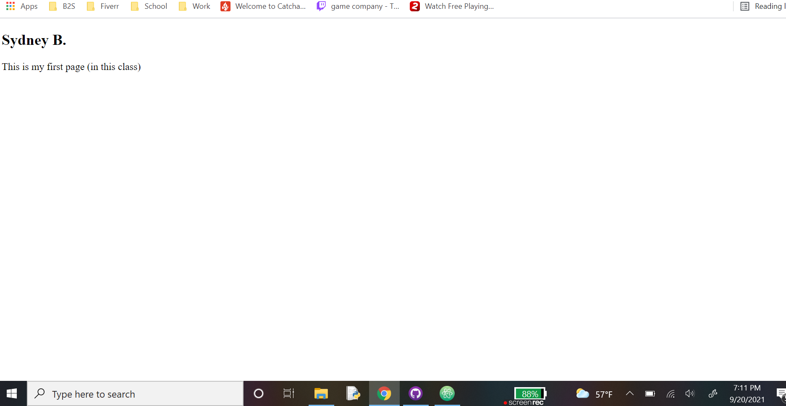

<h4> Very briefly detail how browsers function. List any browsers you currently use to surf - or even develop for - the web. </h3>
A browser functions by processing HTML files so the markup language can display on webpages such as Google Chrome, FireFox etic. I currently use Chrome a lot nowadays.

<h4>What is a markup language? Describe one commonly used in development.</h3>
A markup language is a programing language which will define tags as elements inside a text doc. One commonly used programing language is CSS because it allow our webpages to appear more aesticly pleasing. 

<h4>An embedded image of your screenshot using its relative URL.<h3>

